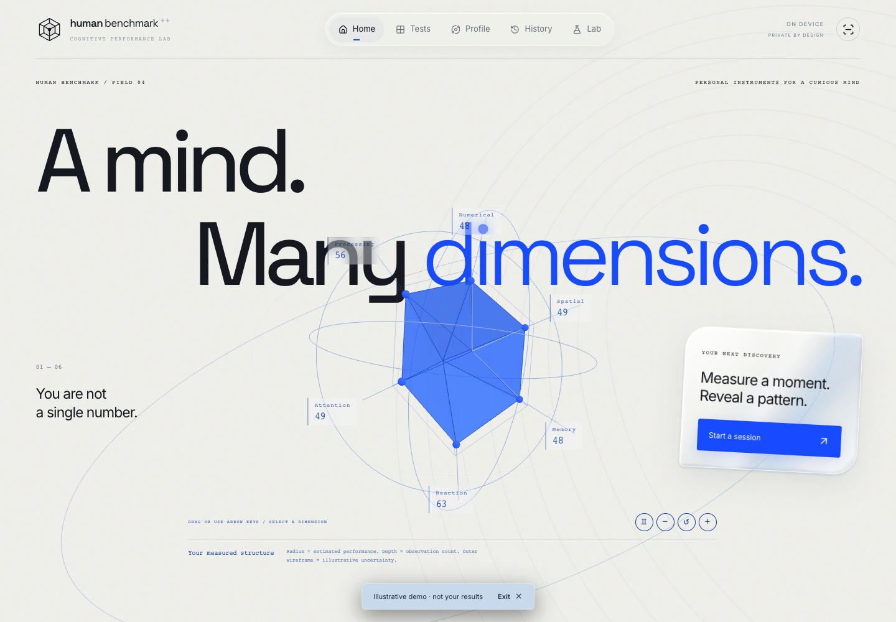
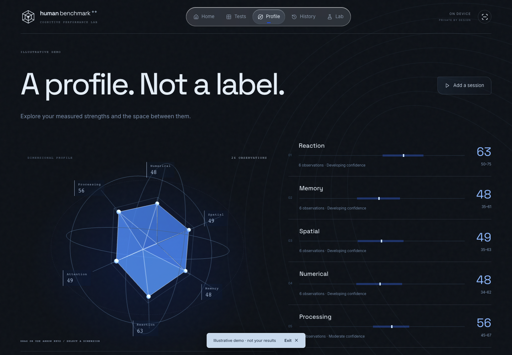
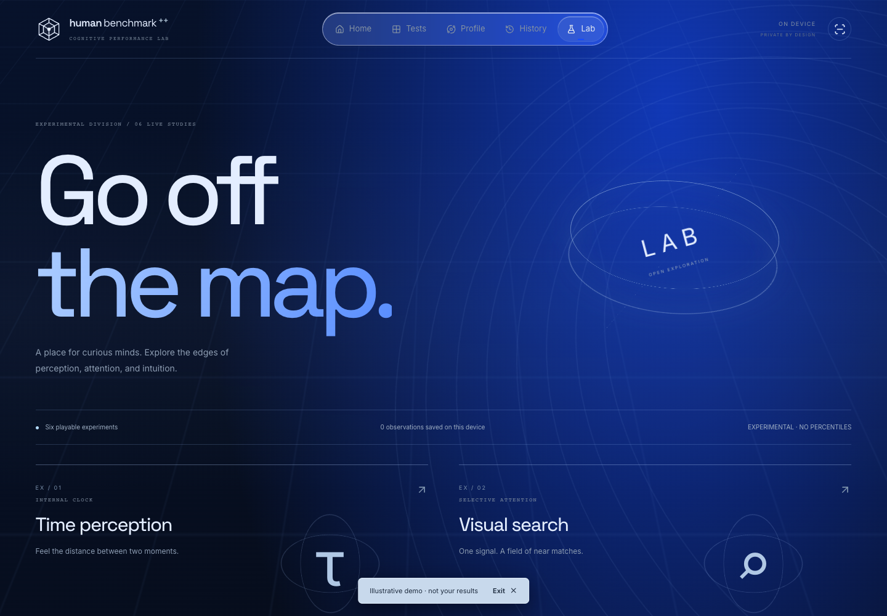

# Human Benchmark++

A browser-based collection of cognitive tests, with adaptive difficulty, a 3D performance profile, and history that stays on your device.

[](https://github.com/jtouevsky/human-benchmark-plus/actions/workflows/ci.yml)
[](LICENSE)



## The idea

A reaction-time score is easy to understand. A picture of how your results change over several sessions is harder to build. This project explores that second part: repeat a test, keep the observations, and make the differences visible.

The interface is also an experiment. You can rotate the profile, inspect its dimensions, and move through a scroll-driven test gallery. The standard results and charts are still there when you want the numbers.

## Inside the app

| Core test | What happens |
| --- | --- |
| Reaction time | Catch a signal after a random delay. Seven valid trials produce a median, fastest time, and variability summary. |
| Visual memory | Recall patterns on grids that grow from 4×4 to 7×7 as difficulty increases. |
| Mental math | Work through ten adaptive rounds of arithmetic, fractions, percentages, and estimation. |
| Spatial reasoning | Match 3D block assemblies across rotations, with mirrored and altered shapes as distractors. |

The **Lab** adds six shorter experiments: time perception, visual search, change blindness, probability intuition, randomness detection, and multi-object tracking. Its results stay separate from the core profile.

<table>
  <tr>
    <td width="50%"><a href="docs/images/profile.png"></a></td>
    <td width="50%"><a href="docs/images/lab.png"></a></td>
  </tr>
  <tr>
    <td><strong>Profile</strong> · Explore dimensions and repeated observations.</td>
    <td><strong>Lab</strong> · Short experiments in perception and attention.</td>
  </tr>
</table>

Screenshots use the app's generated demo profile. They contain no personal test history. Open any image to see it at full size.

## Run it locally

You'll need **Node.js 24** and npm. No account, API key, or database is required.

```bash
git clone https://github.com/jtouevsky/human-benchmark-plus.git
cd human-benchmark-plus
npm ci
npm run dev
```

Open [localhost:3000](http://localhost:3000). Keep the terminal running while using the app; `Ctrl+C` stops it. If you use nvm, `nvm use` selects the version in `.nvmrc`.

To see a populated profile without completing a session, choose **Explore a demo profile** in the footer.

```bash
npm test           # Seeded generator, scoring, and persistence checks
npm run build      # Type-check and export the static site to out/
npm run typecheck  # Standalone TypeScript check
```

The production output can be served by a static host. Development and production have separate build caches. `.env.example` explains how to handle keys if a server-side integration is added later.

## A few implementation details

**Making spatial questions unambiguous.** A shape can look different and still be the same assembly. The [3D generator](lib/spatial.ts) checks all 24 proper cube orientations using translation-normalized coordinates. Reflections and structural changes are treated separately. [Seeded tests](tests/adaptive.cjs) check 300 generated 3D questions across the difficulty range, alongside the original 2D generator.

**Keeping old results comparable.** Changing a test changes what its scores mean. Results carry protocol versions, so the harder 3D task doesn't silently inherit a baseline from the original spatial test. [Validation and profile logic](lib/model.ts) derive the current view from saved observations rather than storing another copy of the same scores.

**Handling timing and interruptions.** The [test engine](components/test-engine.tsx) uses `performance.now()` and animation-frame scheduling for reaction trials. False starts are handled separately. Other tasks pause hidden-tab time or restart an interrupted stimulus. Input-device and browser latency still affect measurements.

**Keeping the 3D view practical.** The [scene](components/cognitive-scene.tsx) loads near the viewport and pauses when offscreen or in a hidden tab. It supports pointer and keyboard controls, uses a lower pixel-density cap on mobile, and falls back to readable values when WebGL is unavailable. Profile radius reflects estimated performance; depth reflects observation count.

## Stack and layout

Next.js 15 · React 19 · TypeScript · Three.js · Framer Motion · CSS / Tailwind CSS 4 tooling

```text
app/          Pages, layout, and styles
components/   Test interfaces, charts, motion, and 3D scenes
lib/          Generators, scoring, validation, and data models
tests/        Deterministic correctness checks
docs/images/  Reviewed screenshots for this README
public/       Static assets
```

Results live in browser `localStorage`. There is no backend, and different browsers have separate histories. Clearing browser storage removes that browser's results. Dependencies are pinned by `package-lock.json`; GitHub Actions runs the tests and production build on pushes to `main` and pull requests.

## Limits and next steps

This is a portfolio experiment, not a validated cognitive assessment. Percentiles and uncertainty bands are illustrative. Processing and attention are derived proxies, and the app doesn't provide an IQ score or diagnosis.

Next, I'd like to expand browser and accessibility coverage, measure rendering performance across devices, and add replayable test batteries. Dual-task interference and Pattern Lab are still concepts. Population comparisons would need properly collected calibration data.

Development included AI-assisted coding. The implementation and tests are available here for review.

## License

[MIT](LICENSE). Third-party dependencies retain their own licenses.
