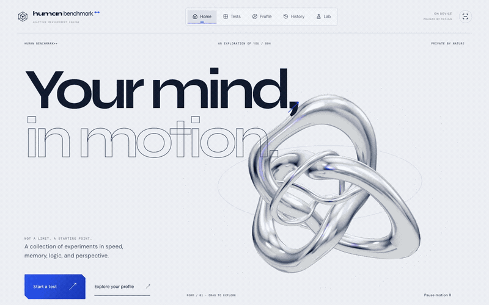
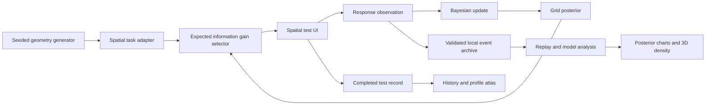

# Human Benchmark++

A browser-based cognitive testing lab with Bayesian spatial measurement, procedural 3D tasks, and an interactive performance atlas.

The engineering question behind this project is simple: **which task should come next, and what did the last answer actually tell us?** The spatial test maintains a probability distribution over performance and selects questions by expected information gain. Reaction, memory, and math tests contribute separate measurements in their original units.

[](docs/assets/walkthrough.mp4)

[Watch the 26-second MP4](docs/assets/walkthrough.mp4) · [Mathematics](docs/mathematics.md) · [Architecture](docs/architecture.md) · [Experiments](docs/experiments.md) · [Visualization](docs/visualization.md)

*Recorded from the running application at 1440 × 900 in a fresh browser profile. Automated responses complete a real spatial session; idle time and intermediate trials are cut. These are demonstration results, not a person's assessment.*

## What you can try

- **Four core tests:** reaction time, visual memory, mental math, and spatial reasoning. Tests have complete result, retry, and history flows; mixed sessions can resume between completed tests.
- **Adaptive spatial measurement:** seeded block assemblies, rotational and reflected distractors, per-answer Bayesian updates, and selection from ten fresh candidates.
- **A performance atlas:** rotate a 3D profile, inspect raw scores, and scrub through saved results. Observation count controls node size; spatial uncertainty has its own band.
- **An experimental Lab:** time perception, visual search, change blindness, probability intuition, randomness detection, and multi-object tracking.
- **Local records:** versioned results and replayable spatial observations live in the browser. No account, backend, or API key is required.

The Bayesian model currently measures **spatial task performance only**. The six-axis visual layout is not a fitted multidimensional intelligence model. This is an exploratory project, not an IQ test or medical diagnostic tool.

## From an answer to the next question

The model stores probability mass on 241 ability values from −6 to 6. Its prior approximates a truncated normal distribution with mean 0 and standard deviation 1.5. A multiple-choice task has difficulty $b$, discrimination $a=1$, and guessing floor $c=1/K$ for $K$ answer choices:

$$p(\theta,t)=c+(1-c)\frac{1}{1+e^{-a(\theta-b)}}.$$

A correct answer favors values of $\theta$ that predict success; an incorrect answer favors values that predict failure. For response $r\in\{0,1\}$, grid weights update as

$$w_i' \propto w_i\,p(\theta_i,t)^r[1-p(\theta_i,t)]^{1-r}.$$

The implementation normalizes in log space and reports the posterior mean, standard deviation, and equal-tail 95% credible interval. Response time is recorded, but does not enter this likelihood.

A fixed progression can waste trials on questions that tell us little. Here, each candidate is evaluated under **both possible responses**. The selector chooses the largest expected reduction in entropy:

$$\operatorname{EIG}(t)=H(w)-q_t H(w^{(1)})-(1-q_t)H(w^{(0)}),\qquad q_t=\sum_i w_i p(\theta_i,t).$$

This is an exact sum over the grid and binary outcomes. The search covers one newly generated question at each of ten levels, not every possible spatial task. Difficulty comes from an explicit geometry-based heuristic, not a calibrated item bank. [Model details and assumptions →](docs/mathematics.md)

## Where the code gets interesting



The numerical engine in [`lib/measurement/model.ts`](lib/measurement/model.ts) has no React or browser dependencies. [`lib/tasks/spatial.ts`](lib/tasks/spatial.ts) connects it to generated geometry. [`lib/experimental-data/store.ts`](lib/experimental-data/store.ts) regenerates tasks and checks posterior history when loading observations. UI components consume those results instead of implementing a second model.

Three implementation decisions shape the project:

1. **Reproducible geometry.** Task IDs retain level and seed. Distractors are checked against all 24 proper cube rotations, making a rotated match distinct from a reflection. Generator versions matter for historical replay.
2. **Inspectable evidence.** Each spatial observation stores its response, before/after estimates, predicted correctness, and selection information. Invalid archives are reported and preserved rather than silently reset.
3. **Separate measurements from presentation.** The posterior surface renders actual density. The atlas shows observation coverage and raw scores. The liquid-metal homepage is decorative, with no statistical meaning attached to its motion.

[Module map, storage boundaries, and failure behavior →](docs/architecture.md)

## Mathematics on screen

| View | What drives it |
| --- | --- |
| Spatial task | Expected information gain selects the actual next generated question. |
| Posterior surface | Horizontal position is ability; height is grid mass divided by grid spacing, scaled to fit. Depth is an extrusion, not another variable. |
| Estimate and interval | Computed mean, standard deviation, and equal-tail grid quantiles. |
| Profile atlas | Node size and depth reflect saved result counts. The spatial outer band scales with model SD. |
| History scrubber | A prefix of completed results, with comparisons within the same test protocol. |
| Chrome sculpture | Procedural mesh deformation, environment reflections, pointer and scroll input. Decorative. |

The rendering uses Three.js directly, including a material shader hook for the density surface, animated SVG, and Framer Motion. Reduced-motion settings and a non-WebGL fallback keep the numerical analysis accessible. [Exact visual mappings →](docs/visualization.md)

## Validation

The reproducible synthetic experiment runs **40 simulated users × 120 trials**, with known abilities between −2 and 2. The current run gives **0.188 mean absolute error** in model units and **39/40 coverage** of nominal 95% credible intervals.

These users answer according to the same likelihood the estimator assumes. The experiment checks implementation and model recovery; it does not establish human reliability, calibrated task difficulty, or an advantage over a fixed test.

Unit tests cover normalization, update direction, an independent mutual-information identity, extreme response sequences, seeded task generation, event replay, and archive preservation. Browser regressions exercise full test completion, persistence, retry, mobile layouts, and interactive rendering. [Reproduce the results and inspect CI findings →](docs/experiments.md)

## Run locally

Use Node.js 24 and npm. No environment configuration is needed; [`.env.example`](.env.example) explains the convention for future integrations.

```bash
git clone https://github.com/jtouevsky/human-benchmark-plus.git
cd human-benchmark-plus
npm ci
npm run dev
```

Open the **Local** URL printed by the server, normally [localhost:3000](http://localhost:3000). If that port is occupied, Next.js prints a different one. Keep the terminal running; press Ctrl+C to stop it.

```bash
npm run lint
npm test
npm run simulate
npm run build
npm run typecheck
```

The production build is a static export in `out/`. To preview it with Python 3:

```bash
python3 -m http.server 3011 --bind 127.0.0.1 --directory out
```

For browser tests, install Google Chrome locally and run `npm run test:browser`. The test runner starts its own development server on port 3010. To test the production preview instead:

```bash
HB_TEST_URL=http://127.0.0.1:3011 npm run test:browser
```

CI installs Playwright Chromium and uses software WebGL. Run builds and type checking sequentially because Next.js generates type files during a build.

## Stack

Next.js 15 static export · React 19 · TypeScript · Three.js · Framer Motion · CSS and Tailwind tooling · browser localStorage · Node test runner · Playwright · GitHub Actions.

The inference and information-gain calculations are implemented in TypeScript without an external statistics service.

## Limits and next steps

Difficulty coefficients still need empirical calibration. The model assumes a fixed scalar ability and conditionally independent responses; learning, fatigue, and device effects can violate that assumption. There is no population norm dataset. Reaction times include browser and hardware latency. Browser storage is local, quota-limited, and not a backup service.

The next useful work is to collect consented item-level data, evaluate calibration and repeat-session reliability, compare selection policies under model mismatch, and version any new fitted parameters. Additional Bayesian dimensions and cross-device sync remain future work.

[MIT license](LICENSE). Built with AI-assisted development; the model's scope, assumptions, and reproducible checks are documented here so its claims can be inspected.
