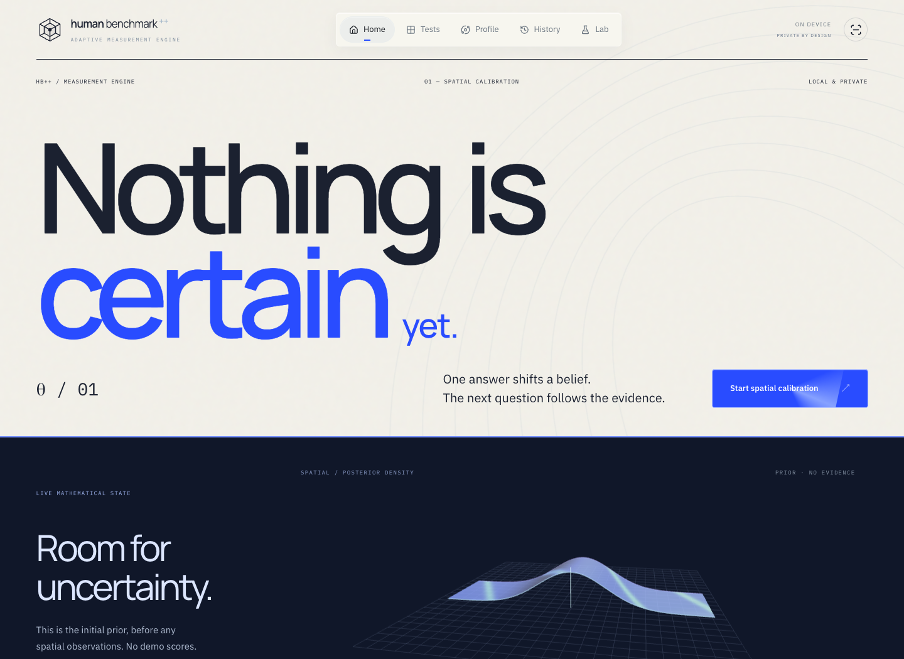
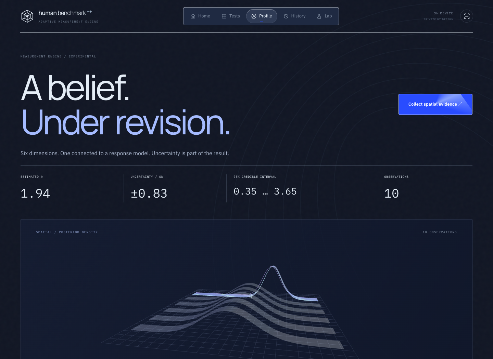
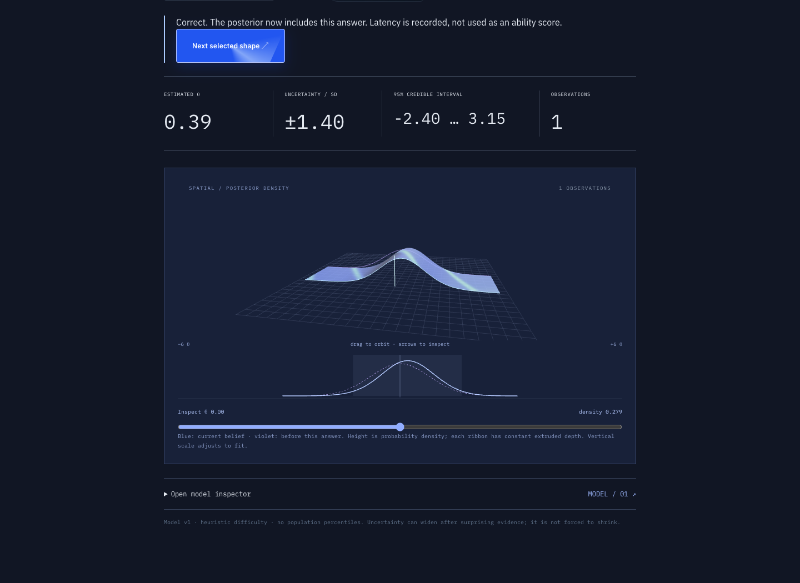

# Human Benchmark++

An adaptive cognitive measurement experiment: answer a spatial question, watch a Bayesian posterior change, and let information gain choose the next task.

[](https://github.com/jtouevsky/human-benchmark-plus/actions/workflows/ci.yml)
[](LICENSE)



## From scores to evidence

Spatial reasoning now runs on a Bayesian measurement engine. Each answer updates a distribution over latent ability, including its uncertainty. The next question is selected by expected entropy reduction across a pool of generated tasks.

The 3D surface is drawn from the same posterior used by the selector. You can rotate it, inspect density values, replay earlier observations, and export the underlying trial records. Five other dimensions remain explicitly unmeasured. The other tests still run their existing protocols.

[Read the model, equations, assumptions, and limitations](docs/measurement.md).

## Inside the app

| Core test | What happens |
| --- | --- |
| Reaction time | Catch a signal after a random delay. Seven valid trials produce a median, fastest time, and variability summary. |
| Visual memory | Recall patterns on grids that grow from 4×4 to 7×7 as difficulty increases. |
| Mental math | Work through ten adaptive rounds of arithmetic, fractions, percentages, and estimation. |
| Spatial reasoning | Match 3D assemblies while Bayesian updates and information gain guide the next question. |

The **Lab** adds six shorter experiments: time perception, visual search, change blindness, probability intuition, randomness detection, and multi-object tracking. Its results stay separate from the core profile.

<table>
  <tr>
    <td width="50%"><a href="docs/images/measurement-profile.png"></a></td>
    <td width="50%"><a href="docs/images/measurement-update.png"></a></td>
  </tr>
  <tr>
    <td><strong>Profile</strong> · Explore dimensions and repeated observations.</td>
    <td><strong>Bayesian update</strong> · See the effect of an actual answer.</td>
  </tr>
</table>

Screenshots show an empty prior and synthetic QA responses, not personal test history. Open any image to see it at full size.

## Run it locally

You'll need **Node.js 24** and npm. No account, API key, or database is required.

```bash
git clone https://github.com/jtouevsky/human-benchmark-plus.git
cd human-benchmark-plus
npm ci
npm run dev
```

Open [localhost:3000](http://localhost:3000). Keep the terminal running while using the app; `Ctrl+C` stops it. If you use nvm, `nvm use` selects the version in `.nvmrc`.

Choose **Start spatial calibration** on Home. After each answer, inspect the updated distribution and open the model inspector to see why the next question was selected. The older demo toggle only affects legacy views; it never feeds the Bayesian model.

```bash
npm test           # Measurement math, seeded generators, and persistence
npm run simulate   # Recover known abilities from synthetic responses
npm run build      # Type-check and export the static site to out/
npm run typecheck  # Standalone TypeScript check
npm run lint       # Source checks
npm run test:browser # Chrome: all core/Lab flows, sessions, and history
```

Browser tests start their own development server on port 3010. To test an already running app, use `HB_TEST_URL=http://localhost:3000 npm run test:browser`. Local tests use installed Google Chrome; CI installs Chromium. The launch checks assert rendered opacity as well as visibility to catch blank test screens.

The production output can be served by a static host. Development and production have separate build caches. `.env.example` explains how to handle keys if a server-side integration is added later.

## A few implementation details

**Making spatial questions unambiguous.** A shape can look different and still be the same assembly. The [3D generator](lib/spatial.ts) checks all 24 proper cube orientations using translation-normalized coordinates. Reflections and structural changes are treated separately. [Seeded tests](tests/adaptive.cjs) check 300 generated 3D questions across the difficulty range, alongside the original 2D generator.

**Updating beliefs and selecting tasks.** The [measurement layer](lib/measurement/model.ts) keeps a normalized posterior on a 241-point grid and computes exact expected entropy reduction for each candidate. [Trial events](lib/experimental-data/store.ts) can reconstruct the complete sequence of beliefs. Difficulty coefficients are currently heuristic.

**Keeping old results comparable.** Changing a test changes what its scores mean. Results carry protocol versions, so the harder 3D task doesn't silently inherit a baseline from the original spatial test. [Validation and profile logic](lib/model.ts) derive the current view from saved observations rather than storing another copy of the same scores.

**Handling timing and interruptions.** The [test engine](components/test-engine.tsx) uses `performance.now()` and a synchronous stimulus update for reaction trials, independently of decorative animation. False starts are handled separately. Other tasks pause hidden-tab time or restart an interrupted stimulus. Input-device and browser latency still affect measurements.

**Drawing the actual posterior.** The [Three.js surface](components/posterior-scene.tsx) updates its vertices from probability density. A moving shader highlight and procedural lighting give it a metallic surface. Keyboard controls, a 2D trace, reduced motion, and a WebGL fallback keep the data accessible.

## Stack and layout

Next.js 15 · React 19 · TypeScript · Three.js · Framer Motion · CSS / Tailwind CSS 4 tooling

```text
app/          Pages, layout, and styles
components/   Test interfaces, charts, motion, and 3D scenes
lib/measurement/       Posterior, likelihood, information gain, simulation
lib/tasks/             Spatial parameters and difficulty estimation
lib/experimental-data/ Validated trial events and replay
lib/                   Existing generators and legacy models
tests/        Deterministic correctness checks
docs/images/  Reviewed screenshots for this README
public/       Static assets
```

Results live in browser `localStorage`. There is no backend, and different browsers have separate histories. Clearing browser storage removes that browser's results. Dependencies are pinned by `package-lock.json`; GitHub Actions runs the tests and production build on pushes to `main` and pull requests.

## Limits and next steps

This is a portfolio experiment, not a validated cognitive assessment. The spatial credible intervals are real Bayesian calculations conditional on an uncalibrated response model. Legacy percentiles remain illustrative. There is no IQ score or diagnosis.

The next technical step is empirical item calibration and model-mismatch testing. A 40-user synthetic recovery run currently has mean absolute error 0.188 θ after 120 trials per user. This does not establish validity for real users. Other dimensions, multidimensional correlations, and response-time models are not implemented.

Development included AI-assisted coding. The implementation and tests are available here for review.

## License

[MIT](LICENSE). Third-party dependencies retain their own licenses.
