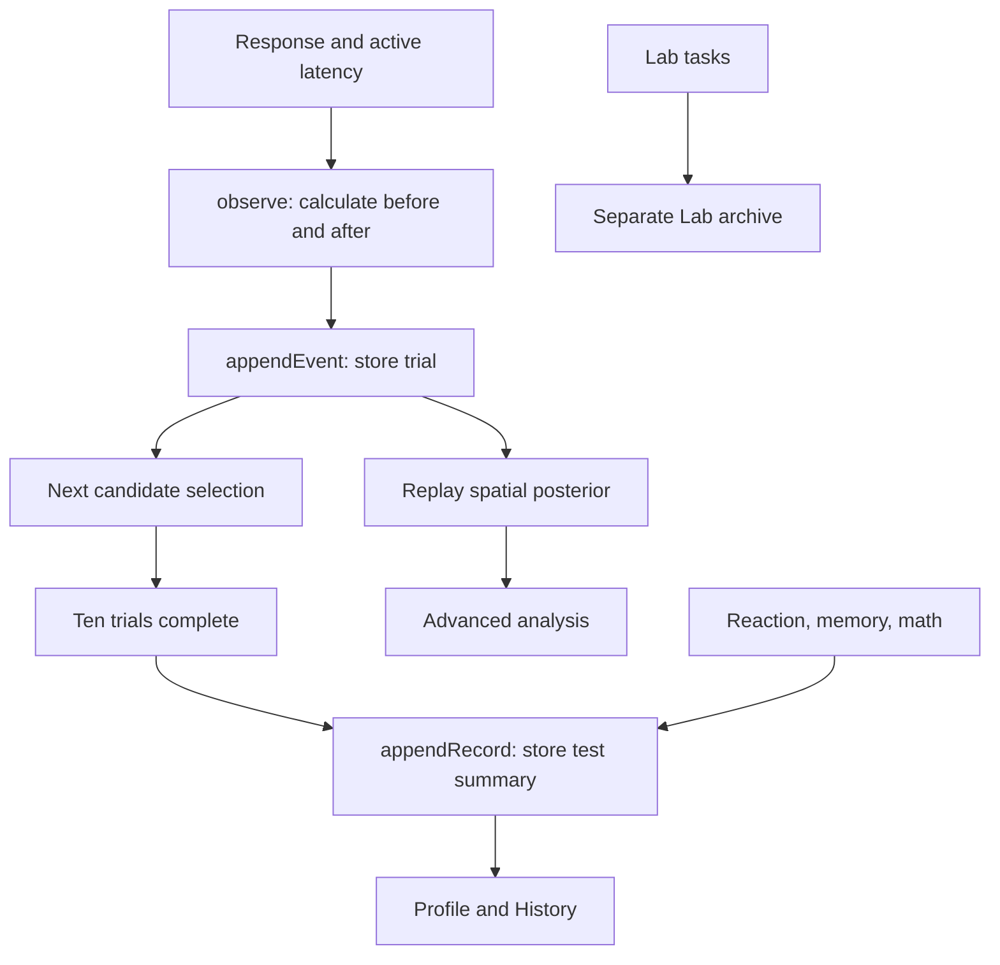

# Architecture and persistence

The app is a static Next.js export. Navigation between Home, Tests, Profile, History, and Lab is client state in [`app/page.tsx`](../app/page.tsx), not a collection of server endpoints.

## Code boundaries

| Layer | Entry points | Responsibility |
| --- | --- | --- |
| Pure model | [`lib/measurement/model.ts`](../lib/measurement/model.ts) | Grid distributions, likelihood, update, summaries, information gain |
| Geometry | [`lib/spatial.ts`](../lib/spatial.ts) | Connected assemblies, proper rotations, distinct distractors |
| Task adapter | [`lib/tasks/spatial.ts`](../lib/tasks/spatial.ts) | Seeded candidates, geometry metadata, heuristic difficulty, selection |
| Observation archive | [`lib/experimental-data/store.ts`](../lib/experimental-data/store.ts) | Events, validation, replay, append guards |
| Core protocols | [`lib/adaptive.ts`](../lib/adaptive.ts), [`lib/model.ts`](../lib/model.ts) | Non-Bayesian progression, result schemas, protocol-specific comparisons |
| Result preservation | [`lib/record-archive.ts`](../lib/record-archive.ts) | Append to the latest stored archive without discarding older fields |
| Views | [`components/profile-world.tsx`](../components/profile-world.tsx), [`components/measurement-panel.tsx`](../components/measurement-panel.tsx) | Raw performance history and optional model analysis |
| Rendering | [`components/cognitive-scene.tsx`](../components/cognitive-scene.tsx), [`components/posterior-scene.tsx`](../components/posterior-scene.tsx) | Atlas and posterior meshes |
| Decorative world | [`components/liquid-metal.tsx`](../components/liquid-metal.tsx), [`components/visual-world.tsx`](../components/visual-world.tsx) | Chrome geometry, scene transitions, pointer/scroll motion |
| Lab | [`components/lab.tsx`](../components/lab.tsx), [`lib/lab.ts`](../lib/lab.ts) | Six exploratory tasks with separate records |

## Two levels of evidence

A spatial **trial** records one answer and updates the posterior immediately. A completed spatial **test** produces a summary after ten trials. The atlas counts completed test records; advanced analysis counts individual observations. Those counts should differ.

## Browser storage

| Key | Contents |
| --- | --- |
| `hb-results-v1` | Versioned core test summaries, including older records |
| `hb-session-v2` | Pending mixed session, resumable between completed tests |
| `hb-lab-v1` | Lab results |
| `hb-measurement-spatial-v1` | Spatial observations and selection metadata |

Spatial loading regenerates each task from its seed and level, validates the response and geometry metadata, and checks stored before/after estimates against replay. Selection fields receive structural checks, and predicted correctness is checked against the update. The loader does not reconstruct and prove the original candidate pool's ranking from scratch.

Malformed or incompatible archives are reported, preserved, and block new measurement writes. Append rejects duplicate spatial task IDs and stale observation counts. The archive limit is 10,000 trials, subject to browser quota. LocalStorage is not transactional across tabs: these guards reduce stale-write risk but are not a cross-tab locking protocol.

Core and Lab append logic reads the latest archive and preserves unknown historical entries. Readers filter supported result schemas. Protocol changes do not silently reinterpret earlier scores. Synthetic demo results do not enter the Bayesian observation archive.

Export is available in advanced analysis. Import, archive rotation, cloud backup, authentication, and cross-device synchronization are not implemented. Clearing browser storage removes local records; Git tracks source history, not a user's browser data.

## Runtime boundaries

Rendering is lazy-loaded where appropriate. Three.js scenes pause offscreen, in hidden tabs, under inert dialogs, and during timing-sensitive tests. Reduced motion limits autonomous animation. The posterior chart and numeric estimates remain useful without WebGL. The rendering layer never determines posterior values.
