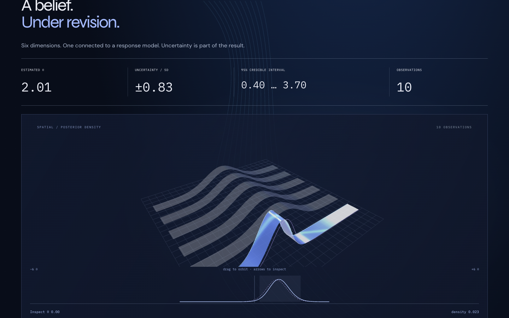
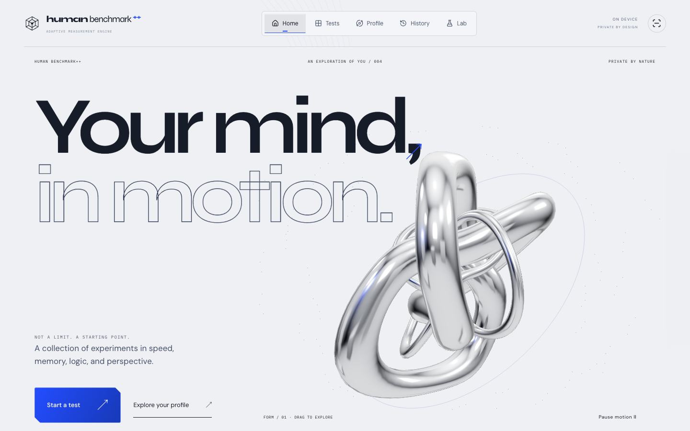

# What the visuals mean

The interface contains both statistical graphics and decorative geometry. They have different jobs.

## Posterior analysis

[`posterior-scene.tsx`](../components/posterior-scene.tsx) builds a surface from the actual normalized grid weights:

- Horizontal coordinate: `theta * 0.62`.
- Height before fitting: `(mass / 0.05) * 3.7`.
- Vertical group scale: `min(1, 3 / peakHeight)` so a narrow density fits the viewport.
- Depth: constant extrusion. It carries no additional statistical variable.

The fitting scale means apparent height is not directly comparable between independently fitted views. Numeric readouts and the 2D density chart provide the quantitative reference. Transitions interpolate old and new masses; intermediate animation frames are presentation, not additional Bayesian updates.

A material `onBeforeCompile` hook adds a moving GLSL highlight. Its brightness has no probabilistic meaning. The optional dimension view lays out the spatial posterior beside five unmeasured priors; spacing is not covariance. The 2D chart uses the same masses and marks the equal-tail interval.



## Cognitive atlas

[`cognitive-scene.tsx`](../components/cognitive-scene.tsx) derives six display nodes from saved results. For a measured node with $n$ current-protocol result records, its radial extent is `1.05 + min(100, log2(n + 1) * 24) / 100 * 1.1`; depth is `min(n, 10) * 0.095`. Unmeasured nodes use the default extent.

This geometry describes observation coverage, not ability, IQ, or a population percentile. Labels show actual latest scores in their original units. The spatial outer band offset is `0.25 * modelSD`; other dimensions have no calibrated confidence band. Processing-speed and attention nodes remain unmeasured.

The profile history slider selects a prefix of completed results. It does not mutate the archive. Raw-score differences compare the same protocol. The advanced model panel uses the current spatial archive; it is not rewound by the atlas history slider.

## Decorative motion

The homepage sculpture uses two deformed torus-knot meshes, recomputed normals, physical chrome materials, and a generated environment map. Pointer attraction, particles, scroll morphing, SVG paths, typography motion, and section colors provide navigation and visual identity. None estimates cognitive performance.

Three.js is used directly; React Three Fiber and GSAP are not dependencies. Framer Motion handles interface transitions. Browser regressions cover keyboard orbit controls and reduced motion. The renderer also provides a WebGL fallback; the current committed suite does not force a WebGL failure.



## Reproduce the showcase

The committed [MP4](assets/walkthrough.mp4) and [GIF](assets/preview.gif) are an edited capture of the actual application. The recorder opens an isolated browser context, submits ten spatial responses through normal controls, verifies one saved result and ten observations, then visits Profile, posterior analysis, and Lab. One response is deliberately incorrect. No scores or screenshots are injected.

Prerequisites: Node 24, installed project dependencies, Google Chrome, Python 3 for serving the static export, and a full FFmpeg build with H.264 and GIF support. FFmpeg is an optional media-production tool, not an app dependency.

```bash
npm run build
python3 -m http.server 3011 --bind 127.0.0.1 --directory out
```

In another terminal:

```bash
npx playwright install ffmpeg
node scripts/capture-showcase.cjs
```

Set `FFMPEG` to the full FFmpeg executable if it is not on PATH. `HB_TEST_URL` overrides the app URL; `CAPTURE_BROWSER` overrides the Playwright browser channel. `CAPTURE_DIR` chooses a new output directory. The script refuses to overwrite encoded media, so choose a fresh directory for another take:

```bash
CAPTURE_DIR=artifacts/showcase-take-2 node scripts/capture-showcase.cjs
```

Review the generated screenshots, `capture.json`, and video before publishing selected files under `docs/assets/`. Raw captures stay ignored under `artifacts/`. Older still images remain under `docs/images/` for history; the README uses the current capture.
